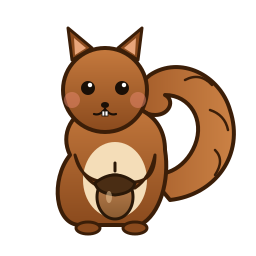

<p align="center">
  
</p>

# ccs — Claude Code Session Manager

[](https://go.dev)
[](LICENSE)
[](https://goreportcard.com/report/github.com/mihai-valentin/ccs)

A fast CLI tool for managing [Claude Code](https://claude.ai/claude-code) sessions. List, search, tag, group by project, and resume sessions — all from your terminal.

## Features

- **List sessions** — scoped to the current project by default, or `--all` to span every project
- **Smart search** — across session names, messages, working directories, git branches, and tag names
- **Tagging** — add custom labels to sessions for easy organization
- **Per-project grouping** — see all sessions for a project at a glance
- **Interactive TUI** — browse, filter, tag, and open sessions visually
- **Quick open** — resume any session in two steps: cd into its project dir + `claude --resume`
- **Incremental indexing** — blazing fast, only re-parses changed files

## Install

### Download a prebuilt release

Prebuilt binaries for Linux and macOS (amd64 + arm64) are published on every tagged release. No Go toolchain required.

1. Grab the archive for your platform from the [latest release](https://github.com/mihai-valentin/ccs/releases/latest) — e.g. `ccs_<version>_linux_amd64.tar.gz`.
2. Extract it and move the binary somewhere on your PATH:

   ```bash
   tar -xzf ccs_*_linux_amd64.tar.gz
   sudo install -m 0755 ccs /usr/local/bin/ccs
   # or, no sudo: install -m 0755 ccs ~/.local/bin/ccs
   ```

3. Verify:

   ```bash
   ccs --help
   ```

Each release also ships a `checksums.txt` so you can verify the archive with `sha256sum -c checksums.txt`. Pin a specific version by downloading its tagged release instead of `latest`.

### From source

Requires [Go 1.22+](https://go.dev/dl/).

```bash
# Clone the repository
git clone https://github.com/mihai-valentin/ccs.git
cd ccs

# Build the binary (output: ./bin/ccs)
make build

# Install system-wide to /usr/local/bin (usually needs sudo)
sudo make install

# Or install for the current user to ~/.local/bin (no sudo, assumes ~/.local/bin is on PATH)
make install-user

# Or install to a custom prefix
PREFIX=$HOME/opt make install   # → $HOME/opt/bin/ccs

# Uninstall (mirror the install flags you used)
sudo make uninstall
```

### Manual build (without Make)

```bash
go build -o bin/ccs ./cmd/ccs/
sudo install -m 0755 bin/ccs /usr/local/bin/ccs
```

## Usage

### List sessions

```bash
ccs list              # Current project's sessions (most recent first)
ccs list --all        # All sessions across all projects
ccs list -t bugfix    # Filter by tag
ccs list -p nexus     # Filter by project (partial match)
ccs list -n 50        # Show more results (default: 20)
```

Both `list` and `search` default to the **current project**. The project is detected by walking up from your cwd and matching the deepest ancestor that appears in the index — so running the commands from a subdirectory (e.g. `internal/tui`) still returns the containing project's sessions. Use `--all` to drop the scope, or `-p <name>` to target a specific project.

### Search

```bash
ccs search "auth middleware"   # Name, messages, cwd, branch, and tag names
ccs search bugfix              # A tag name works as a query too
ccs search "NEX-73" --all      # Search across all projects
```

### Show details

```bash
ccs show <name-or-id>         # Full metadata, tags, message preview
ccs show distributed-painting-dragonfly
```

### Open / resume a session

```bash
ccs open <name-or-id>               # cd + claude --resume in current terminal
ccs open <name-or-id> --new-terminal # Open in a new shell process
```

Session identifiers can be: full UUID, UUID prefix (4+ chars), session name (exact or fuzzy).

### Tag management

```bash
ccs tag <session> bugfix wip         # Add tags
ccs untag <session> wip              # Remove a tag
ccs tags                             # List all tags with counts
```

### Projects

```bash
ccs projects                         # List all projects with session counts
```

### AI summaries (optional)

`ccs summarize` generates a one-line summary of a session's conversation using a local [Ollama](https://ollama.com) instance. This is **entirely optional** — every other command works without it, and sessions without summaries simply render with an empty summary field.

```bash
ccs summarize <name-or-id>           # Summarize one session
ccs summarize --all                  # Summarize every session missing a summary
ccs summarize <id> --force           # Regenerate an existing summary
ccs summarize <id> --model llama3.2  # Use a different model
```

**Requirements:** a running Ollama server reachable at `http://localhost:11434` with a model pulled locally. Defaults: `gemma3:4b`. Override with `--ollama-url` and `--model`.

If Ollama isn't running, `ccs summarize` fails fast with a clear error (`cannot reach Ollama at ...`). All other `ccs` commands are unaffected.

### Interactive TUI

```bash
ccs ui
```

Key bindings:
- `↑/↓` or `j/k` — navigate
- `Enter` — open session
- `/` — search (real-time filter)
- `t` — add/remove tags
- `d` — delete session
- `Tab` — cycle project filter
- `?` — help
- `q` — quit

### Other

```bash
ccs reindex                          # Force full re-index
ccs completion bash > /etc/bash_completion.d/ccs  # Shell completions
```

### Global flags

```
--db-path <path>      Path to SQLite database (default: ~/.config/ccs/ccs.db)
--claude-dir <path>   Path to Claude data dir (default: ~/.claude)
--json                Machine-readable JSON output (on list/search/show)
```

## How it works

Claude Code stores session data as JSONL files in `~/.claude/projects/`. `ccs` scans these files, extracts metadata (name, messages, timestamps, branch), and indexes everything into a local SQLite database. The index is updated incrementally — only changed files are re-parsed.

Tags and labels are stored in the SQLite database only; `ccs` never modifies Claude Code's files.

## Contributing

Contributions are welcome! Please read [CONTRIBUTING.md](CONTRIBUTING.md) for details on:

- Setting up the development environment
- Running tests
- Code style guidelines
- Branch naming conventions
- Submitting pull requests

## Built with AI

This project was 100% generated using [Claude Code](https://claude.ai/claude-code) (Anthropic's CLI coding agent) and a custom multi-agent orchestration tool that parallelizes development tasks across isolated git worktrees. From design spec to implementation, bug fixes, and CI/CD pipeline — every line of code was written by AI agents.

## Credits

- ASCII squirrel shown on bare `ccs` invocation is by Erik Andersson, from [ascii.co.uk/art/squirrel](https://ascii.co.uk/art/squirrel).

## License

This project is licensed under the MIT License — see the [LICENSE](LICENSE) file for details.
